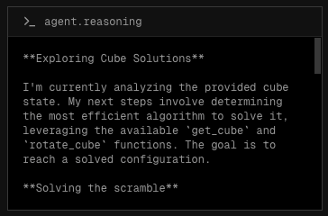
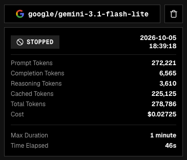

An application to test the **Rubik's Cube** solving capabilities of **Large Language Models (LLMs).**

## Getting Started

**Copy environment variables:**

```bash
cp .env.sample .env

OPENROUTER_API_KEY=<add-openrouter-api-key>
```

**Spin up services:**

```bash
make run
```

This following services will be available:

| Service | URL |
|---|---|
| Agent Cube App | [http://localhost:3000](http://localhost:3000) |
| Agent Cube API | [http://localhost:8080](http://localhost:8080) |
| Arize Phoenix | [http://localhost:6006](http://localhost:6006) |

Go to [Agent Cube App](http://localhost:3000) - create a **Rubik's Cube** and watch the **agent** attempt to **solve it!**

## Features

#### Stream Agent Reasoning

Stream agent reasoning to see live reasoning from the LLM.



#### Token and Cost Tracking

Token and cost tracking in both the app and through **Arize**.



#### Decisions API Support

Support for models like Jev through the Decisions API.
