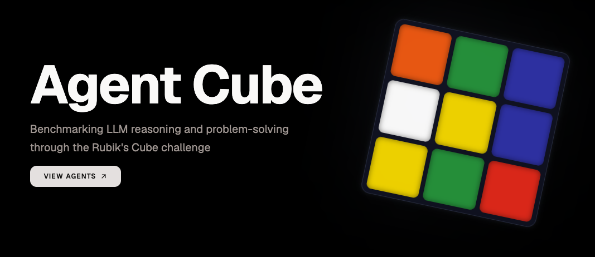

An application to test the **Rubik's Cube** solving capabilities of **Large Language Models (LLMs).**

## Technologies

- [TanStack](https://tanstack.com)
- [Go](https://go.dev)
- [Google ADK](https://google.github.io/adk/)
- [OpenRouter](https://openrouter.ai)
- [Arize Phoenix](https://phoenix.arize.com/)

## Getting Started

**1. Copy the environment variables from `.env.sample`:**

```bash
cp .env.sample .env
```

**2. Open `.env` and fill in the required values:**

| Variable | Action |
|---|---|
| `OPENROUTER_API_KEY` | Visit [OpenRouter](https://openrouter.ai), generate an API key, and set this value. |

**3. Spin up the services:**

```bash
podman compose up --build -d
```

This following services will be available:

| Service | URL |
|---|---|
| Agent Cube | [http://localhost:3001](http://localhost:3001) |
| Arize Phoenix | [http://localhost:6006](http://localhost:6006) |

Go to [http://localhost:3001](http://localhost:3001) - create a **Rubik's Cube** and watch the **agent** attempt to solve it!

**4. (Optional) Extend the suite of large language models:**

The list of supported LLMs is defined in [`internal/domain/ai.go`](./internal/domain/ai.go).

Add a new entry to the `LLMs` slice to include another model:

```go
var LLMs = []LLM{
	NewLLM("openai", "openai/gpt-5.4-mini"),
	NewLLM("anthropic", "anthropic/claude-haiku-4.5"),
	NewLLM("google", "google/gemini-3.1-flash-lite"),
	NewLLM("moonshot", "moonshotai/kimi-k2.7-code"),
	NewLLM("x-ai", "x-ai/grok-4.3"),
	NewLLM("deepseek", "deepseek/deepseek-v4-pro"),
}
```

Then run the **build** command again:

```bash
podman compose up --build -d
```
