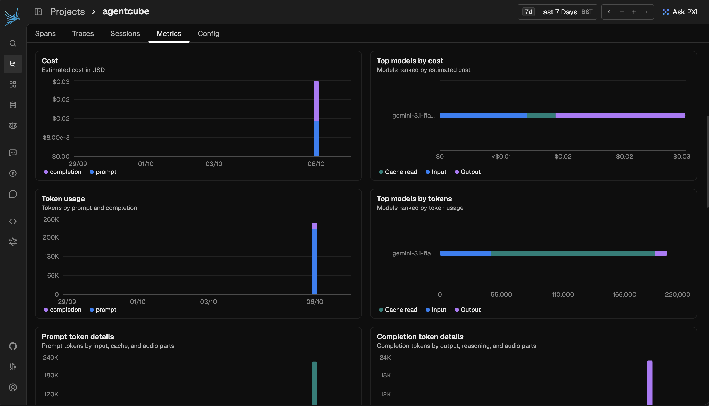

An application to test the **Rubik's Cube** solving capabilities of **Large Language Models (LLMs).**

## Getting Started

**Copy environment variables:**

```bash
cp .env.sample .env

OPENROUTER_API_KEY=<add-openrouter-api-key>
```

**Spin up services:**

```bash
docker compose up --build -d
```

This following services will be available:

| Service | URL |
|---|---|
| Agent Cube App | [http://localhost:3000](http://localhost:3000) |
| Agent Cube API | [http://localhost:8080](http://localhost:8080) |
| Arize Phoenix | [http://localhost:6006](http://localhost:6006) |

Go to [Agent Cube App](http://localhost:3000) - create a **Rubik's Cube** and watch the **agent** attempt to **solve it!**

## Features

#### Stream Agent Reasoning


#### Token and Cost Tracking


#### AI Tracing with Arize Phoenix



#### Decisions API Support

Support for models like **Jev** through the **Decisions API.**

## Demo

<video src="https://pub-c3f719b201ec41e2bddd39eb50e5856d.r2.dev/agentcube-demo.mov" width="100%" controls></video>

## License

Agent Cube is licensed under the **MIT License**. See [LICENSE](./LICENSE) for details.
